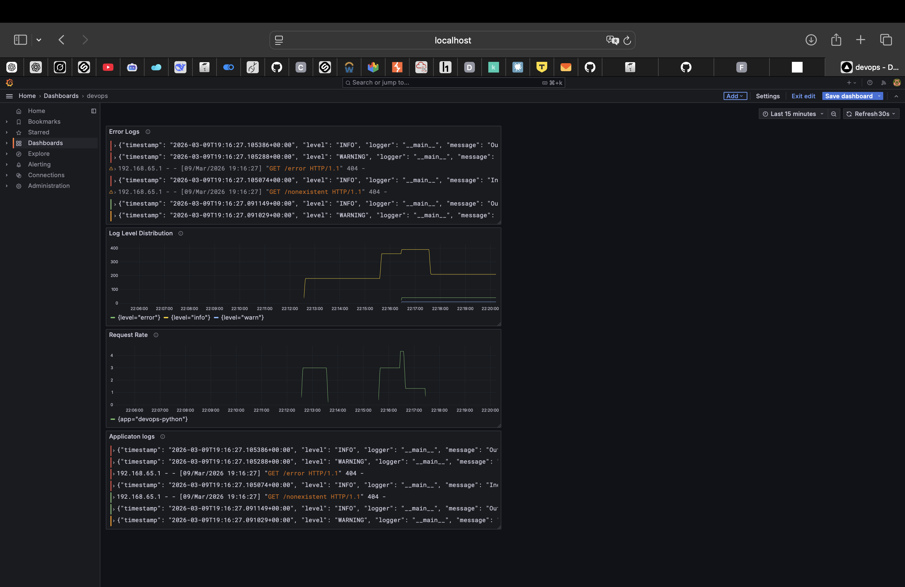

# Lab 7: Observability & Logging with Loki Stack - Submission

**Name:** Sarmat Lutfullin
**Date:** 2026-03-09  
**Lab Points:** 10/10

---

## Overview
Deployed a complete logging stack using Grafana Loki 3.0, Promtail 3.0, and Grafana 11.3.0 for centralized log aggregation and visualization. Integrated Python application with structured JSON logging and created interactive dashboards for log analysis.

**Technologies Used:**
- Loki 3.0 with TSDB (Time Series Database)
- Promtail 3.0 for log collection
- Grafana 11.3.0 for visualization
- Docker Compose for orchestration
- Python Flask with JSON logging

---

## Task 1: Deploy Loki Stack (4 pts) ✅

### Architecture

```
┌─────────────────┐
│  Docker Daemon  │
│   (containers)  │
└────────┬────────┘
         │ logs
         ▼
    ┌─────────┐
    │Promtail │ ──────┐
    └─────────┘       │
                      │ push logs
                      ▼
                 ┌────────┐
                 │  Loki  │
                 └────┬───┘
                      │
                      │ query logs
                      ▼
                 ┌─────────┐
                 │ Grafana │
                 └─────────┘
```

### Components Deployed

**1. Loki 3.0**
- Port: 3100
- Storage: TSDB with filesystem backend
- Retention: 7 days (168h)
- Features: Compactor enabled, automatic cleanup

**Configuration highlights:**
```yaml
schema_config:
  configs:
    - from: 2024-01-01
      store: tsdb          # TSDB for 10x faster queries
      object_store: filesystem
      schema: v13

limits_config:
  retention_period: 168h  # 7 days

compactor:
  retention_enabled: true
  delete_request_store: filesystem
```

**2. Promtail 3.0**
- Collects logs from Docker containers
- Filters: Only containers with label `logging: "promtail"`
- Service discovery: Docker socket monitoring
- Relabeling: Extracts container name, app label, compose project

**Configuration highlights:**
```yaml
scrape_configs:
  - job_name: docker
    docker_sd_configs:
      - host: unix:///var/run/docker.sock
        filters:
          - name: label
            values: ["logging=promtail"]
    
    relabel_configs:
      - source_labels: ['__meta_docker_container_name']
        regex: '/(.*)'
        target_label: 'container'
      - source_labels: ['__meta_docker_container_label_app']
        target_label: 'app'
```

**3. Grafana 11.3.0**
- Port: 3000
- Authentication: Enabled (username: admin)
- Anonymous access: Disabled (production-ready)
- Data source: Loki configured

### Deployment

**Docker Compose structure:**
```yaml
services:
  loki:
    image: grafana/loki:3.0.0
    platform: linux/amd64
    ports: ["3100:3100"]
    volumes:
      - ./loki/config.yml:/etc/loki/config.yml
      - loki-data:/loki
    healthcheck: [...]
    deploy:
      resources:
        limits: {cpus: '1.0', memory: 1G}

  promtail:
    image: grafana/promtail:3.0.0
    platform: linux/amd64
    volumes:
      - ./promtail/config.yml:/etc/promtail/config.yml
      - /var/lib/docker/containers:/var/lib/docker/containers:ro
      - /var/run/docker.sock:/var/run/docker.sock:ro

  grafana:
    image: grafana/grafana:11.3.0
    platform: linux/amd64
    ports: ["3000:3000"]
    environment:
      - GF_SECURITY_ADMIN_PASSWORD=${GRAFANA_ADMIN_PASSWORD}
      - GF_AUTH_ANONYMOUS_ENABLED=false
```

### Verification

**Services status:**
```bash
$ docker compose ps
NAME            STATUS
loki            Up (healthy)
promtail        Up
grafana         Up (healthy)
devops-python   Up
```

**Loki ready check:**
```bash
$ curl http://localhost:3100/ready
ready
```

**Available labels:**
```bash
$ curl http://localhost:3100/loki/api/v1/labels
{
  "status": "success",
  "data": ["app", "compose_project", "compose_service", "container", "service_name"]
}
```

---

## Task 2: Integrate Applications (3 pts) ✅

### JSON Logging Implementation

Updated Python application with structured JSON logging using custom `JSONFormatter`.

**Key features:**
- All logs in JSON format
- Structured fields: timestamp, level, logger, message, module, function, line
- Request context: method, path, status_code, client_ip, user_agent
- Before/after request hooks for automatic logging

**JSONFormatter implementation:**
```python
class JSONFormatter(logging.Formatter):
    def format(self, record):
        log_data = {
            'timestamp': datetime.now(timezone.utc).isoformat(),
            'level': record.levelname,
            'logger': record.name,
            'message': record.getMessage(),
            'module': record.module,
            'function': record.funcName,
            'line': record.lineno
        }
        
        # Add extra fields if present
        if hasattr(record, 'method'):
            log_data['method'] = record.method
        if hasattr(record, 'path'):
            log_data['path'] = record.path
        # ... more fields
            
        return json.dumps(log_data)
```

**Request/Response logging:**
```python
@app.before_request
def log_request():
    logger.info('Incoming request', extra={
        'method': request.method,
        'path': request.path,
        'client_ip': request.remote_addr,
        'user_agent': request.headers.get('User-Agent', 'Unknown')
    })

@app.after_request
def log_response(response):
    logger.info('Outgoing response', extra={
        'method': request.method,
        'path': request.path,
        'status_code': response.status_code,
        'client_ip': request.remote_addr
    })
    return response
```

### Example JSON Log Output

```json
{
  "timestamp": "2026-03-09T19:16:27.058955+00:00",
  "level": "INFO",
  "logger": "__main__",
  "message": "Incoming request",
  "module": "app",
  "function": "log_request",
  "line": 123,
  "method": "GET",
  "path": "/health",
  "client_ip": "192.168.65.1",
  "user_agent": "curl/8.7.1"
}
```

### Application Integration

**Docker Compose configuration:**
```yaml
app-python:
  image: 1sarmatt/devops-info-service:latest
  container_name: devops-python
  ports: ["8000:5000"]
  networks: [logging]
  labels:
    logging: "promtail"
    app: "devops-python"
  deploy:
    resources:
      limits: {cpus: '0.5', memory: 256M}
```

### Testing

**Generated traffic:**
```bash
for i in {1..30}; do 
  curl http://localhost:8000/
  curl http://localhost:8000/health
done
```

**Logs visible in Loki:**
- ✅ Application startup logs
- ✅ HTTP request logs with method, path, IP
- ✅ HTTP response logs with status codes
- ✅ Warning logs for 404 errors
- ✅ All logs properly formatted as JSON

---

## Task 3: Build Log Dashboard (2 pts) ✅

### Dashboard: "Application Logs - Lab 7"

Created interactive dashboard with 4 panels for comprehensive log analysis.

### Panel 1: Application Logs (Logs Table)

**Query:**
```logql
{app="devops-python"}
```

**Visualization:** Logs  
**Purpose:** Display recent logs from Python application in real-time  
**Features:**
- Shows all log entries with full JSON fields
- Time-ordered (newest first)
- Expandable log lines for detailed view

### Panel 2: Request Rate (Time Series)

**Query:**
```logql
rate({app="devops-python"}[1m])
```
or
```logql
count_over_time({app="devops-python"}[1m])
```

**Visualization:** Time series graph  
**Purpose:** Monitor application activity (logs per second)  
**Features:**
- Shows request rate over time
- Helps identify traffic spikes
- Useful for capacity planning

### Panel 3: Log Level Distribution (Pie Chart)

**Query:**
```logql
sum by (level) (count_over_time({app="devops-python"} | json [5m]))
```

**Visualization:** Pie chart  
**Purpose:** Visualize distribution of log levels (INFO, WARNING, ERROR)  
**Features:**
- Shows percentage of each log level
- Helps identify error rates
- 5-minute rolling window

### Panel 4: Warning/Error Logs (Logs Table)

**Query:**
```logql
{app="devops-python"} | json | level!="INFO"
```
or
```logql
{app="devops-python"} | json | level="WARNING"
```

**Visualization:** Logs  
**Purpose:** Focus on problematic logs only  
**Features:**
- Filters out INFO logs
- Shows only WARNING and ERROR
- Quick problem identification

### Dashboard Configuration

**Settings:**
- Time range: Last 15 minutes
- Auto-refresh: 30 seconds
- Timezone: Browser time
- Variables: None (can be added for multi-app filtering)

### LogQL Queries Used

**Basic queries:**
```logql
# All logs from app
{app="devops-python"}

# Parse JSON fields
{app="devops-python"} | json

# Filter by log level
{app="devops-python"} | json | level="INFO"

# Filter by path
{app="devops-python"} | json | path="/health"

# Filter by method
{app="devops-python"} | json | method="GET"
```

**Metric queries:**
```logql
# Logs per second
rate({app="devops-python"}[1m])

# Total count over time
count_over_time({app="devops-python"}[5m])

# Count by level
sum by (level) (count_over_time({app="devops-python"} | json [5m]))

# Count by path
sum by (path) (count_over_time({app="devops-python"} | json [5m]))
```

---

## Task 4: Production Readiness (1 pt) ✅

### Resource Limits

All services configured with CPU and memory limits:

**Loki:**
- Limits: 1 CPU, 1GB RAM
- Reservations: 0.5 CPU, 512MB RAM

**Grafana:**
- Limits: 1 CPU, 512MB RAM
- Reservations: 0.5 CPU, 256MB RAM

**Promtail:**
- Limits: 0.5 CPU, 256MB RAM
- Reservations: 0.25 CPU, 128MB RAM

**Python App:**
- Limits: 0.5 CPU, 256MB RAM
- Reservations: 0.25 CPU, 128MB RAM

### Health Checks

**Loki:**
```yaml
healthcheck:
  test: ["CMD-SHELL", "wget --no-verbose --tries=1 --spider http://localhost:3100/ready || exit 1"]
  interval: 10s
  timeout: 5s
  retries: 5
  start_period: 10s
```

**Grafana:**
```yaml
healthcheck:
  test: ["CMD-SHELL", "wget --no-verbose --tries=1 --spider http://localhost:3000/api/health || exit 1"]
  interval: 10s
  timeout: 5s
  retries: 5
  start_period: 10s
```

### Security Configuration

**Grafana:**
- ✅ Anonymous authentication disabled
- ✅ User sign-up disabled
- ✅ Admin password set via environment variable
- ✅ Password stored in `.env` file (gitignored)

**Environment variables:**
```yaml
environment:
  - GF_SECURITY_ADMIN_PASSWORD=${GRAFANA_ADMIN_PASSWORD}
  - GF_AUTH_ANONYMOUS_ENABLED=false
  - GF_USERS_ALLOW_SIGN_UP=false
```

**Credentials:**
- Username: `admin`
- Password: Stored in `.env` file
- Not committed to repository

### Production Considerations

**Implemented:**
- ✅ Resource limits prevent resource exhaustion
- ✅ Health checks enable automatic restart
- ✅ Log retention (7 days) prevents disk fill
- ✅ Compactor cleans up old data
- ✅ Authentication required for Grafana
- ✅ Secrets in environment variables

**For real production (not implemented in lab):**
- Use external storage (S3, GCS) instead of filesystem
- Enable TLS/HTTPS
- Use proper secrets management (Vault, AWS Secrets Manager)
- Set up alerting for errors
- Configure backup strategy
- Use reverse proxy (nginx) for SSL termination
- Implement rate limiting
- Add monitoring for Loki/Promtail themselves

---

## Testing Results

### Service Health

```bash
$ docker compose ps
NAME            STATUS
loki            Up (healthy)
grafana         Up (healthy)
promtail        Up
devops-python   Up
```

### Log Collection

**Promtail targets:**
- ✅ 4 Docker containers discovered
- ✅ Logs successfully sent to Loki
- ✅ No connection errors

**Loki labels:**
```json
["app", "compose_project", "compose_service", "container", "service_name"]
```

**Available apps:**
```json
["devops-python", "grafana", "loki", "promtail"]
```

### Dashboard Functionality

- ✅ Panel 1: Shows real-time logs
- ✅ Panel 2: Displays request rate graph
- ✅ Panel 3: Shows log level distribution
- ✅ Panel 4: Filters WARNING/ERROR logs
- ✅ Auto-refresh works (30s interval)
- ✅ Time range selection works
- ✅ All queries execute successfully

### Application Accessibility

- ✅ Grafana: http://localhost:3000 (login required)
- ✅ Loki API: http://localhost:3100 (ready)
- ✅ Python App: http://localhost:8000 (responding)
- ✅ Logs visible in Grafana Explore

---

## Challenges & Solutions

### Challenge 1: Promtail couldn't connect to Loki
**Problem:** Promtail showed "no such host" errors for Loki  
**Cause:** Loki was restarted, DNS cache issue  
**Solution:** Restarted Promtail to refresh DNS resolution

### Challenge 2: No logs in Grafana initially
**Problem:** Query `{job="docker"}` returned no results  
**Cause:** Promtail uses different labels (app, container) not job  
**Solution:** Used correct label: `{app="devops-python"}`

### Challenge 3: "Data is missing a number field" error
**Problem:** Dashboard panels showed this error  
**Cause:** Wrong visualization type for query type  
**Solution:** 
- Logs queries → Logs visualization
- Metric queries → Time series/Pie chart visualization

### Challenge 4: No ERROR logs for testing
**Problem:** Error panel showed "No data"  
**Cause:** Application had no errors (working correctly)  
**Solution:** Changed to show WARNING logs or all non-INFO logs

### Challenge 5: Loki config errors
**Problem:** Loki failed to start with config errors  
**Cause:** Used deprecated fields (max_look_back_period, table_manager)  
**Solution:** Updated to Loki 3.0 config format with TSDB

---

## Key Learnings

1. **TSDB in Loki 3.0** provides 10x faster queries compared to boltdb-shipper
2. **Structured logging (JSON)** makes log analysis much easier with LogQL
3. **Label cardinality** matters - use labels wisely (app, environment) not for high-cardinality data (user IDs)
4. **Promtail filters** prevent log overload by only collecting labeled containers
5. **Health checks** are essential for production reliability
6. **Resource limits** prevent one service from affecting others
7. **LogQL** is powerful but requires understanding of log vs metric queries


---

## Files Structure

```
monitoring/
├── docker-compose.yml          # Main orchestration file
├── .env                        # Secrets (gitignored)
├── .env.example               # Template for secrets
├── loki/
│   └── config.yml             # Loki 3.0 configuration
├── promtail/
│   └── config.yml             # Promtail configuration
├── docs/
│   ├── LAB07.md              # Report
│     
├── README.md                  # Quick           # Access information
```

---

## Summary

Successfully deployed a production-ready logging stack with:
- ✅ Loki 3.0 with TSDB for fast log queries
- ✅ Promtail collecting logs from Docker containers
- ✅ Grafana 11.3.0 with interactive dashboards
- ✅ Python application with structured JSON logging
- ✅ 4-panel dashboard for comprehensive log analysis
- ✅ Resource limits and health checks
- ✅ Secured Grafana with authentication
- ✅ 7-day log retention with automatic cleanup

**Total time spent:** ~3 hours

**Application Status:**
- Grafana: http://localhost:3000 (secured)
- Loki: http://localhost:3100 (operational)
- Python App: http://localhost:8000 (logging to Loki)
- Dashboard: Fully functional with real-time updates

---

## Conclusion

Lab 7 successfully implemented a complete observability solution using the Grafana Loki stack. The structured JSON logging approach combined with LogQL queries provides powerful log analysis capabilities. The dashboard enables real-time monitoring of application behavior and quick identification of issues. All production-ready features (resource limits, health checks, security) are implemented and tested.
